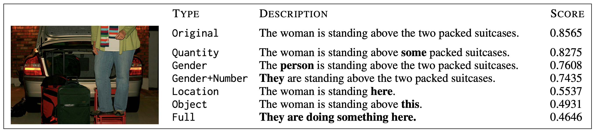

# sunglass
Semantic UNderspecification in visually-Grounded LAnguage proceSSing


Code and data presented in:

- Pezzelle (2023). [Dealing with Semantic Underspecification in Multimodal NLP](https://arxiv.org/pdf/2306.05240.pdf). To appear in ACL 2023

**Abstract**
Intelligent systems that aim at mastering language as humans do must deal with its semantic underspecification, namely, the possibility for a linguistic signal to convey only part of the information needed for communication to succeed. Consider the usages of the pronoun they, which can leave the gender and number of its referent(s) underspecified. Semantic underspecification is not a bug but a crucial language feature that boosts its storage and processing efficiency. Indeed, human speakers can quickly and effortlessly integrate semantically underspecified linguistic signals with a wide range of non-linguistic information, e.g., the multimodal context, social or cultural conventions, and shared knowledge. Standard NLP models have, in principle, no or limited access to such extra information, while multimodal systems grounding language into other modalities, such as vision, are naturally equipped to account for this phenomenon. However, we show that they struggle with it, which could negatively affect their performance and lead to harmful consequences when used for applications. In this position paper, we argue that our community should be aware of semantic underspecification if it aims to develop language technology that can successfully interact with human users. We discuss some applications where mastering it is crucial and outline a few directions toward achieving this goal.



```
@article{pezzelle2023dealing,
  title={Dealing with Semantic Underspecification in Multimodal {NLP}},
  author={Pezzelle, Sandro},
  journal={To appear in the Proceedings of ACL 2023},
  url={https://arxiv.org/pdf/2306.05240.pdf},
  year={2023}
}
```


***